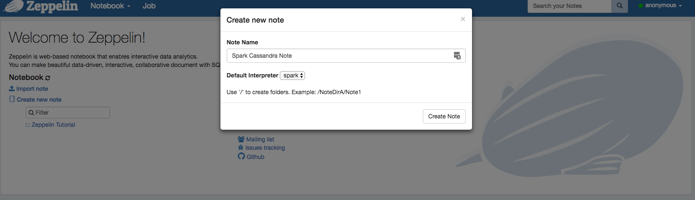
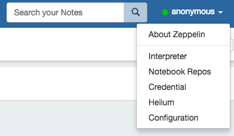
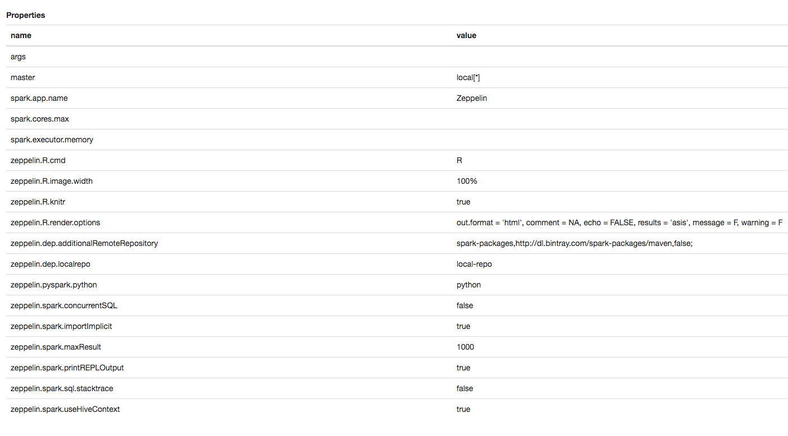
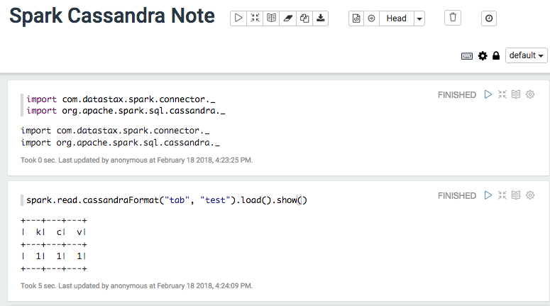

# Setting up your Spark Cassandra Dev Environment

A quick workshop on building your first Spark Cassandra Stand Alone Application. In this workshop we will
walk through setting up our Spark and Cassandra Dev environment. In addition we wil setup Zeppelin
to use as a Spark Interpreter. 

## Downloading our components

[Download Apache Spark 2.2.1](https://www.apache.org/dyn/closer.lua/spark/spark-2.2.1/spark-2.2.1-bin-hadoop2.7.tgz)

[Download Apache Cassandra 3.0.15](http://www.apache.org/dyn/closer.lua/cassandra/3.0.15/apache-cassandra-3.0.15-bin.tar.gz)

[Download Apache Zeppelin 0.7.3](http://mirrors.gigenet.com/apache/zeppelin/zeppelin-0.7.3/zeppelin-0.7.3-bin-netinst.tgz)

## Let's start by testing Zeppelin

### Start up Cassandra

    tar -xvf apache-cassandra-3.0.15-bin.tar.gz
    cd apache-cassandra-3.0.15
    ./bin/cassandra
    
### Test out our Cassandra Connection

    ./bin/cqlsh
    
    CREATE KEYSPACE test WITH replication = {'class': 'SimpleStrategy', 'replication_factor': 1 };
    use test;
    CREATE TABLE tab ( k int, c int, v int, PRIMARY KEY (k,c))
    INSERT INTO tab (k , c , v ) VALUES ( 1, 1, 1) ;
    SELECT * FROM test.tab;
    
     k | c | v
    ---+---+---
     1 | 1 | 1
     
### What does our Cassandra Table look like?

    k :: partition key
    c :: clustering key
    v :: a value

On disk this looks like

    k1 -> (c1,v1) , (c2,v2), (c3,v3)
    k2 -> (c1,v1) , (c2,v2), (c3,v3)
   
    
#### Important Cassandra Concepts
For more information on Cassandra and Data Layout
* Tokens : Where data lives
* DataModeling : How data is laid out on disk
* Replication : How many copies of the data will there be on the Server
* Consistency Level : How many acknowledgements the Client needs for success  

Study more later!
[Datastax Academy](https://academy.datastax.com/)

#### Setup Spark and Spark Home
   
   tar -xvf spark-2.2.1-bin-hadoop2.7.tgz

   

#### Add Spark-Cassandra-Connector

Edit our environment
    
Add to conf/spark-defaults :  
    
    cp spark-defaults.conf.template spark-defaults.conf

edit spark-defaults.conf file

    spark.jars.packages   datastax:spark-cassandra-connector:2.0.7-s_2.11
    
[Spark Cassandra Connector at Spark Packages](https://spark-packages.org/package/datastax/spark-cassandra-connector)
    
### Set up Zeppelin

    tar -xvf zeppelin-0.7.3-bin-netinst.tgz
    
Set SPARK_HOME for Zeppelin to our spark directory
Edit zeppelin-0.7.3-bin-netinst/conf/zeppelin-env.sh
    
    export SPARK_HOME="/Users/russellspitzer/SparkInstalls/spark-2.2.1-bin-hadoop2.7" ## Replace this with your install directory

    
#### Start Zeppelin   
    
    ./zeppelin-0.7.3-bin-netinst/bin/zeppelin.sh
    
### Zeppelin Home Screen

[Local Zeppelin](http://localhost:8080/#/)

* Name is just something personal to identify the notebook for us
* Interpreter is the code execution engine used for snippets

### Setting up the Interpreter

Important for us

* master : The Spark Resource manager used for our Application

### Go over some basics with Dataframes

[Dataframe Notebook](notebooks/Spark%20Cassandra%20Note.json)

